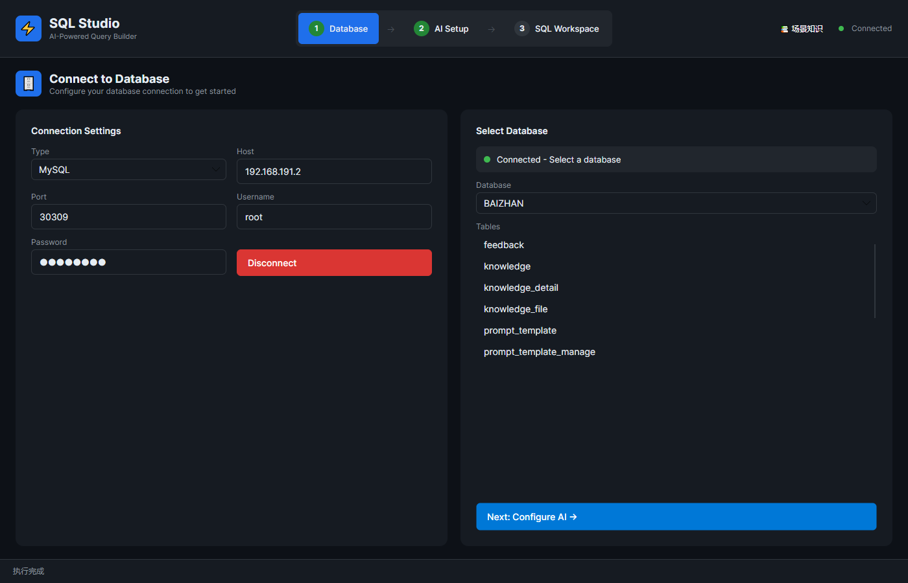
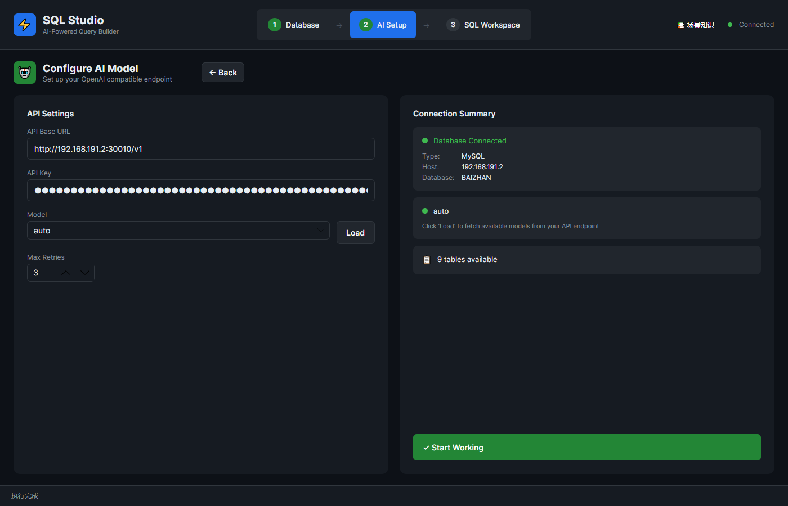
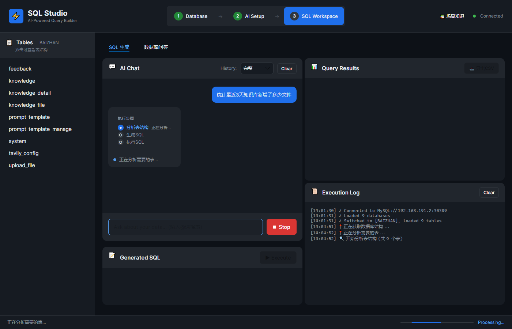
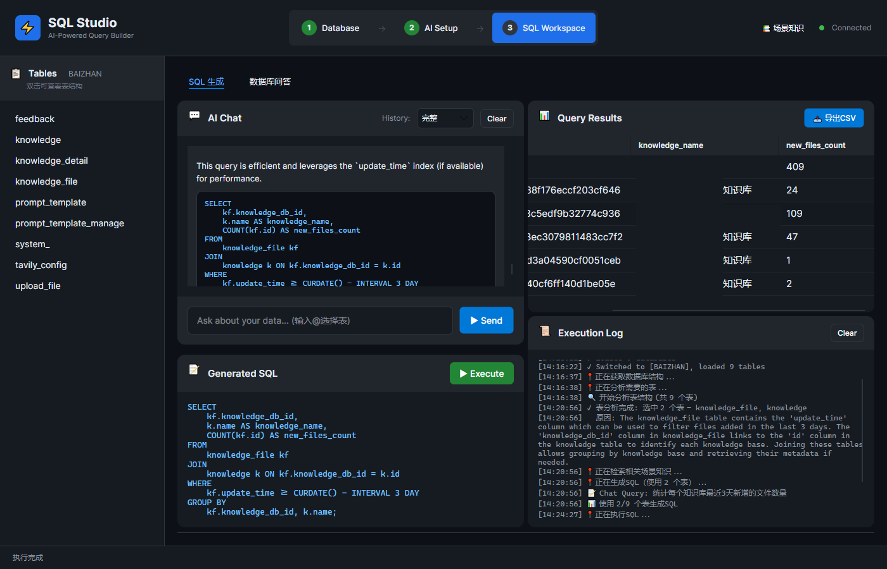
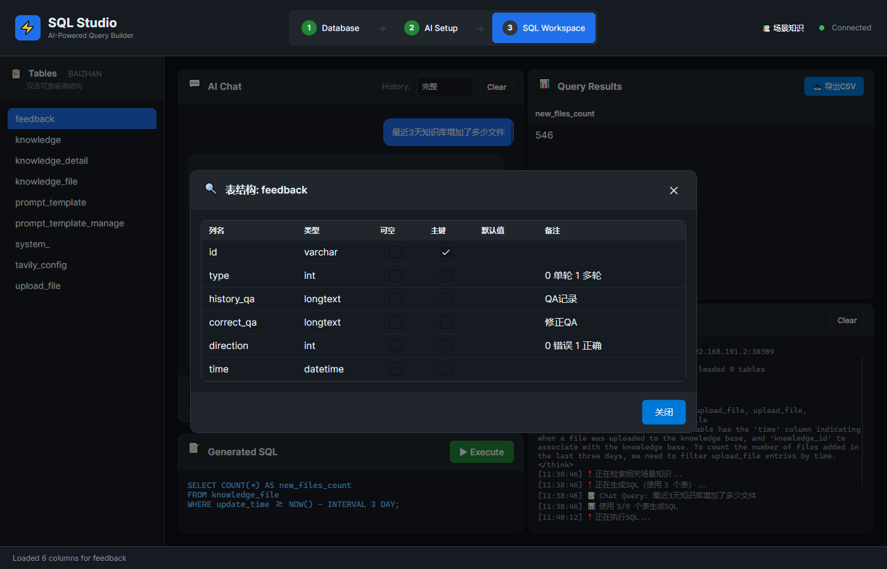
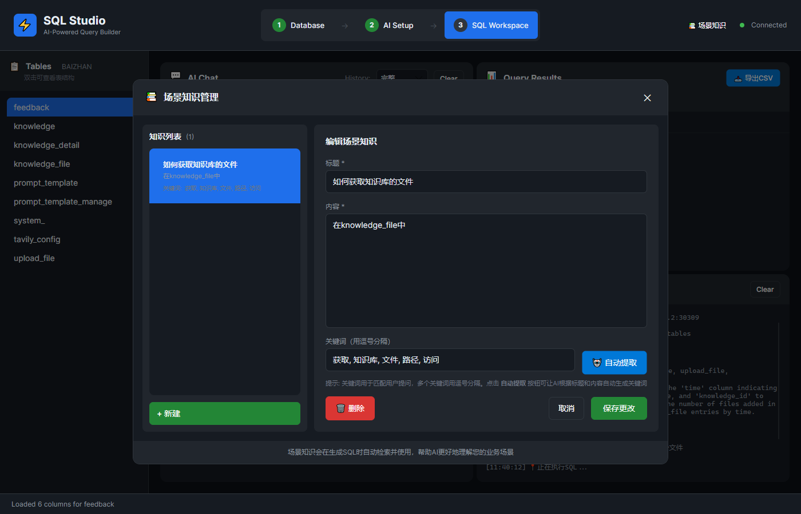
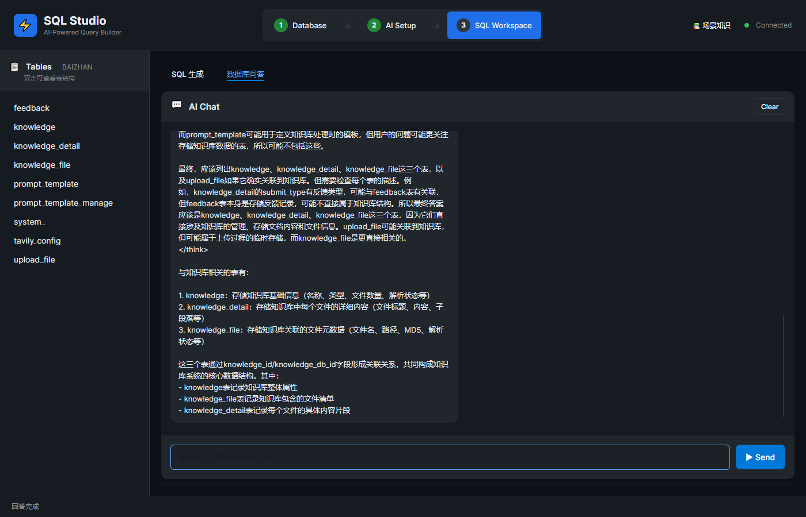

 📊 查看表 📊 查看 📊  📊 <div align="center">

# ⚡ SQL Studio

**🤖 AI-Powered Natural Language to SQL Desktop Application**

> 💬 用自然语言描述需求，AI 帮你生成并执行 SQL

<div>

[](https://dotnet.microsoft.com/)
[](https://avaloniaui.net/)
[](https://github.com/microsoft/semantic-kernel)
[](LICENSE)

</div>

<br/>

[✨ 功能特性](#-功能特性) • [🚀 快速开始](#-快速开始) • [📸 截图演示](#-截图演示) • [🛠️ 技术栈](#️-技术栈) • [🤝 贡献指南](#-贡献指南)

</div>
 
---
 
## 📸 截图演示

<div align="center">

### 🎯 核心功能展示

| 🔗 连接数据库 | 🤖 配置 AI | 💬 SQL 生成中 |
|:---:|:---:|:---:|
|  |  |  |
| *快速连接多种数据库* | *灵活配置 AI 服务* | *AI 分析表结构* |

| 💬 SQL 生成完成 | 📊 查看表结构| 📚 场景知识库 |
|:---:|:---:|:---:|
|  |  |  |
| *生成 SQL 并执行* | *可视化数据展示* | *业务知识沉淀* |

| 🧠 数据库问答 |
|:---:|
|  |
| *智能问答理解数据库结构* |

</div>

> 💡 **提示**：截图展示应用的完整工作流程，从数据库连接到 SQL 生成执行的全过程
 
---
 
## ✨ 功能特性

<div align="center">

### 🎨 核心亮点

</div>

<table>
<tr>
<td width="50%">

#### 🤖 AI 驱动

- ⚡ **自然语言转 SQL** - 用中文/英文描述需求，AI 自动生成
- 🌊 **流式输出** - 实时查看 SQL 生成过程
- 🔄 **智能重试** - 执行失败自动修正（可配置次数）
- 🧠 **表结构感知** - AI 自动分析相关表结构

</td>
<td width="50%">

#### 💬 聊天式交互

- 💭 **对话上下文** - 支持多轮对话优化 SQL
- @ **表名提及** - 精确指定要查询的表
- 📜 **历史模式** - 完整历史 / 仅上次 SQL
- ⏹️ **一键停止** - 随时中断生成过程

</td>
</tr>
<tr>
<td width="50%">

#### 🗄️ 多数据库支持

<div>

- ✅ **MySQL** - 广泛使用的开源数据库
- ✅ **PostgreSQL** - 功能强大的关系型数据库
- ✅ **SQL Server** - 企业级数据库解决方案
- ✅ **ClickHouse** - 高性能列式数据库

</div>

</td>
<td width="50%">

#### 📊 结果管理

- 📋 **DataGrid 预览** - 表格化展示查询结果
- 💾 **一键导出 CSV** - 快速导出数据
- 🔍 **表结构查看** - 双击表名查看列信息
- 📝 **执行日志** - 完整的执行过程记录

</td>
</tr>
<tr>
<td colspan="2">

#### 📚 场景知识库

> 💡 沉淀业务口径、约束条件、常用查询模式，让 AI 生成更贴合业务的 SQL

</td>
</tr>
</table>
 
---
 
## 🚀 快速开始

### 📋 环境要求

<div align="center">

| 依赖 | 版本 | 说明 |
|:---:|:---:|:---|
| 🟣 **.NET SDK** | `9.0+` | [下载地址](https://dotnet.microsoft.com/download) |
| 🗄️ **数据库** | `-` | MySQL / PostgreSQL / SQL Server / ClickHouse 之一 |
| 🤖 **AI 服务** | `-` | OpenAI API 或兼容接口 / Ollama |

</div>

### ⚙️ 安装运行

```bash
# 1️⃣ 克隆仓库
git clone https://github.com/your-username/SQLStudio.git
cd SQLStudio

# 2️⃣ 还原依赖
dotnet restore

# 3️⃣ 运行应用
dotnet run --project SQLStudio/SQLStudio.csproj
```

### 🎯 三步工作流

<div align="center">

```
┌─────────────────────┐      ┌─────────────────────┐      ┌─────────────────────┐
│   1️⃣ 连接数据库      │  ➜   │   2️⃣ 配置 AI         │  ➜   │   3️⃣ SQL 工作区       │
│                      │      │                      │      │                      │
│  • 选择数据库类型     │      │  • 填写 API 地址      │      │  • 输入自然语言       │
│  • 填写连接信息       │      │  • 加载模型列表       │      │  • 查看生成的 SQL     │
│  • 选择目标库         │      │  • 选择模型          │      │  • 执行并查看结果     │
└─────────────────────┘      └─────────────────────┘      └─────────────────────┘
```

</div>
 
---
 
## 🛠️ 技术栈

<div align="center">

| 类别 | 技术 |
|:---:|:---|
| 🎨 **框架** | .NET 9 / Avalonia UI 11.3 |
| 🏗️ **架构** | MVVM (CommunityToolkit.Mvvm) |
| 🤖 **AI** | Microsoft Semantic Kernel + OpenAI / Ollama Connector |
| 🗄️ **数据库** | MySqlConnector / Npgsql / Microsoft.Data.SqlClient / ClickHouse.Client |

</div>

### 🌐 支持的 AI 服务

<div align="center">

| 服务 | 说明 |
|:---:|:---|
| 🔵 **OpenAI** | 官方 API 或任何兼容 `/v1` 接口的服务 |
| 🔷 **Azure OpenAI** | 通过 OpenAI 兼容方式接入 |
| 🟢 **Ollama** | 本地部署的开源模型 |
| 🔶 **其他** | 任何 OpenAI API 兼容的网关/代理 |

</div>
 
---
 
## 📁 项目结构

```
SQLStudio/
├── 📂 Core/
│   ├── 📂 AI/              # LLM 集成（模型服务、SQL 生成器）
│   ├── 📂 Database/        # 数据库连接器与元数据
│   └── 📂 Services/        # 业务服务（设置、知识库、Agent）
├── 📂 ViewModels/          # MVVM ViewModel
├── 📂 Converters/          # 值转换器
├── 📄 MainWindow.axaml     # 主界面
├── 📄 App.axaml            # 应用入口
└── 📄 appsettings.json     # 示例配置
```
 
---
 
## ⚙️ 配置说明

### 📂 数据存储位置

应用会自动在用户目录创建配置文件：

<div align="center">

| 文件 | Windows 路径 | 说明 |
|:---:|:---:|:---|
| `settings.json` | `%APPDATA%\SQLStudio\` | 连接信息、AI 配置 |
| `scenario_knowledge.json` | `%APPDATA%\SQLStudio\` | 场景知识库 |

</div>

### 🔒 安全建议

> ⚠️ **重要提示**：请勿在仓库中提交真实的数据库密码或 API Key

- 🔐 使用最小权限的数据库账号
- 🔑 API Key 建议使用环境变量或安全存储
- 🛡️ 定期更新依赖包以获取安全补丁
 
---
 
## 🗺️ Roadmap

<div align="center">

| 功能 | 状态 | 描述 |
|:---:|:---:|:---|
| 🔒 SQL 安全策略 | 🚧 规划中 | 只读模式、危险语句拦截 |
| 📊 结果集优化 | 🚧 规划中 | 分页与大表优化 |
| 🎨 提示词调优 | 🚧 规划中 | 可视化提示词调优界面 |
| 📦 发行版打包 | 🚧 规划中 | Windows/macOS/Linux 安装包 |
| 🔄 自动更新 | 🚧 规划中 | 自动更新机制 |
| 🌐 多语言支持 | 🚧 规划中 | 国际化支持 |

</div>
 
---
 
## 🤝 贡献指南

<div align="center">

**欢迎提交 Issue 和 Pull Request！** 🎉

</div>

### 📝 提交 Issue

请包含以下信息：

- 💻 操作系统与 .NET 版本
- 🗄️ 数据库类型与版本
- 🤖 AI Provider 信息
- 📋 复现步骤与期望行为

### 🔀 提交 PR

- ✅ 保持改动聚焦，一个 PR 解决一个问题
- 📸 提供必要的说明和截图
- 🚫 **禁止提交任何密钥或敏感数据**
- 📖 遵循项目的代码风格和规范
 
---
 
## 📄 License

本项目采用 [MIT License](LICENSE) 开源。

---

<div align="center">

### ⭐ 如果这个项目对你有帮助，请给一个 Star！

Made with ❤️ by [Your Name]

---

**SQL Studio** - 让 SQL 生成变得简单自然 🚀

</div>
